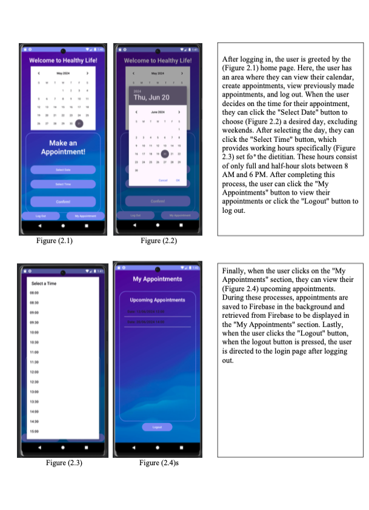

# Doctor Appointment System 📅

A mobile application developed with **Android Studio** for managing doctor-patient appointments efficiently. The app enables users to create accounts, book appointments, view appointment history, and receive reminders.

---

## 🌟 Features
- **User Authentication**: Secure login and registration using Firebase Authentication.
- **Appointment Booking**: Patients can book appointments with registered doctors.
- **Appointment History**: View previously booked appointments.
- **Notifications**: Reminder notifications for upcoming appointments.
- **Firebase Integration**: Realtime Database for storing and retrieving appointment data.

---

## 🎯 Purpose
The app is designed to streamline the appointment process for both doctors and patients. Doctors can register on the platform and allow patients to book appointments with them. It provides a seamless and user-friendly interface for both parties.

---

## 🔧 Technologies Used
- **Android Studio**: Development environment
- **Firebase Authentication**: User login and registration
- **Firebase Realtime Database**: Data storage and synchronization
- **Java/Kotlin**: Programming languages
- **Material Design**: UI/UX design

---

## 🚀 Installation
1. Clone the repository:
   ```bash
   git clone https://github.com/ozanozenn/doctor-appointment-system.git


   ## 🖼️ Screenshots

### 1. Login Screen

